# **Case Study #1 - Danny's Diner**

## 🍜 **Business Case**
In early 2021, Danny opened a little Japanese restaurant selling food: sushi, curry, and ramen.

Danny wants to use the data to answer a few simple questions about his customers, especially about their visiting patterns, how much money they’ve spent and also which menu items are their favourite. He plans on using these insights to help him decide whether he should expand the existing customer loyalty program.<br>
<br>

---

## 🍜 **Dataset**
Danny has shared with you 3 key datasets for this case study:
- `sales`
- `menu`
- `members`

### **ERD**

<details>
  <summary>Click to view ERD</summary>

<p align="center">
  <kbd>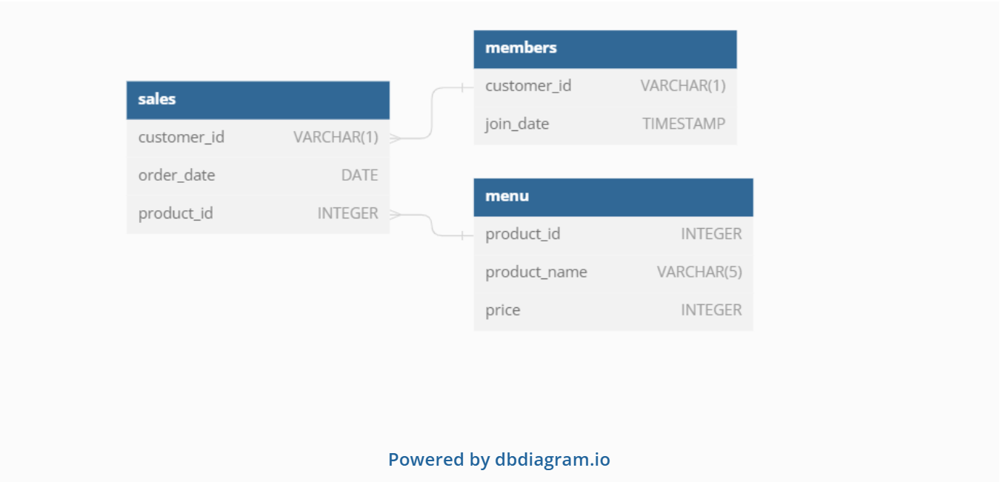 </kbd> <br>
</p>

</details>

### **Table Example**

<details>
  <summary>Click to view table</summary>
<br>
    
**Table 1: `sales`** <br>
The sales table captures all customer_id level purchases with an corresponding order_date and product_id information for when and what menu items were ordered.

 **customer_id** | **order_date** | **product_id** 
:---------------:|:--------------:|:---------------:
 A               | 2021-01-01     | 1               
 A               | 2021-01-01     | 2               
 A               | 2021-01-07     | 2               
 A               | 2021-01-10     | 3               
 A               | 2021-01-11     | 3               
 A               | 2021-01-11     | 3               
 B               | 2021-01-01     | 2               
 B               | 2021-01-02     | 2               
 B               | 2021-01-04     | 1               
 B               | 2021-01-11     | 1               
 B               | 2021-01-16     | 3               
 B               | 2021-02-01     | 3               
 C               | 2021-01-01     | 3               
 C               | 2021-01-01     | 3               
 C               | 2021-01-07     | 3               

<br>

**Table 2: `menu`** <br>
The menu table maps the product_id to the actual product_name and price of each menu item.

 **product_id** | **product_name** | **price** 
:--------------:|:----------------:|:----------:
 1              | sushi            | 10         
 2              | curry            | 15         
 3              | ramen            | 12         

<br>

**Table 3: `members`** <br>
The final members table captures the join_date when a customer_id joined the beta version of the Danny’s Diner loyalty program.

 **customer_id** | **join_date** 
:---------------:|:--------------:
 A               | 2021-01-07         
 B               | 2021-01-09     
 
<br>
</details>

### **Case Study Question**

<details>
  <summary>Click to view questions</summary>
<br>
    
Each of the following case study questions can be answered using a single SQL statement:
1. What is the total amount each customer spent at the restaurant?
2. How many days has each customer visited the restaurant?
3. What was the first item from the menu purchased by each customer?
4. What is the most purchased item on the menu and how many times was it purchased by all customers?
5. Which item was the most popular for each customer?
6. Which item was purchased first by the customer after they became a member?
7. Which item was purchased just before the customer became a member?
8. What is the total items and amount spent for each member before they became a member?
9. If each $1 spent equates to 10 points and sushi has a 2x points multiplier - how many points would each customer have?
10. In the first week after a customer joins the program (including their join date) they earn 2x points on all items, not just sushi - how many points do customer A and B have at the end of January?
    
<br>
</details>

<br>

---

## 🍜 **Solution**
### ***1. What is the total amount each customer spent at the restaurant?***

#### **Steps :**
- Use **SUM** and **GROUP BY** to calculate total_amount - `price`, each `customer_id`.
- Use **JOIN** to merge `sales` and `menu` tables as customer_id and `price` are from both tables.

#### **Query :**

```sql
SELECT 
	customer_id,
	SUM(price) AS total_amount
FROM sales AS s
JOIN menu AS m
	ON s.product_id = m.product_id
GROUP BY 1
ORDER BY 2 DESC
```

#### **Answer :**

<p align="left">
  <kbd>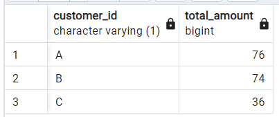 </kbd> <br>
</p>

- Customer A spent 76 dolar
- Customer B spent 74 dolar
- Customer C spent 36 dolar

<br>

---

### ***2. How many days has each customer visited the restaurant?***

#### **Steps :**
- Use **COUNT** of **DISTINCT** `order_date` because the number of days may be repeated
- Use **GROUP BY** `customer_id` to calculate days by each customer

#### **Query :**

```sql
SELECT 
	customer_id,
	COUNT(DISTINCT (order_date)) AS days_count
FROM sales
GROUP BY 1
```

#### **Answer :**

<p align="left">
  <kbd>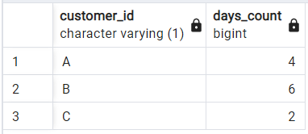 </kbd> <br>
</p>

- Customer A visited 4 times.
- Customer B visited 6 times.
- Customer C visited 2 times.

<br>

---

### ***3. What was the first item from the menu purchased by each customer?***

#### **Steps :**
- Create a temp table/**CTE** `item_order` and use **windows function** with **DENSE_RANK** to create a new column rank based on `order_date`
- Filter from cte table with **WHERE** rank = 1 only and **GROUP BY** by all columns

#### **Query :**

```sql
WITH item_order AS
(
	SELECT
		customer_id,
		order_date,
		product_name,
		DENSE_RANK() OVER(PARTITION BY s.customer_id ORDER BY s.order_date) AS rank
	FROM sales AS s
	JOIN menu AS m
		ON s.product_id = m.product_id
	)
SELECT
	customer_id,
	product_name
FROM item_order
WHERE rank = 1
GROUP BY 1, 2
```

#### **Answer :**

<p align="left">
  <kbd>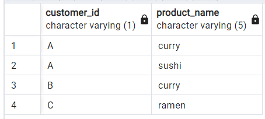 </kbd> <br>
</p>

- Customer A's first order items are curry and sushi.
- Customer B's first order item is curry.
- Customer C's first order item is ramen.

<br>

---

### ***4. What is the most purchased item on the menu and how many times was it purchased by all customers?***

#### **Steps :**
- Use **COUNT** of `product_id` then **ORDER BY** `total_sold` by descending order
- Filter with **LIMIT 1** to find top purchased item

#### **Query :**

```sql
SELECT 
	product_name,
	COUNT(product_name) AS total_sold
FROM sales AS s
JOIN menu AS m
	ON s.product_id = m.product_id
GROUP BY 1
ORDER BY 2 DESC
LIMIT 1
```

#### **Answer :**

<p align="left">
  <kbd>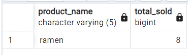 </kbd> <br>
</p>

Ramen is the most purchased item on the menu, which is 8 times sold

<br>

---

### ***5. Which item was the most popular for each customer?***

#### **Steps :**
- Create a `popular_item` CTE, use **DENSE_RANK** to rank the `order_count` for each product by descending order for each customer
- Filter results **WHERE** product **rank = 1**

#### **Query :**

```sql
WITH popular_item AS
(
	SELECT
		customer_id,
		product_name,
		DENSE_RANK() OVER(PARTITION BY s.customer_id ORDER BY COUNT(m.product_name) DESC) AS rank
	FROM sales AS s
	JOIN menu AS m
		ON s.product_id = m.product_id
	GROUP BY 1, 2
	)
SELECT 
	customer_id,
	product_name
FROM popular_item
WHERE rank = 1
```

#### **Answer :**

<p align="left">
  <kbd>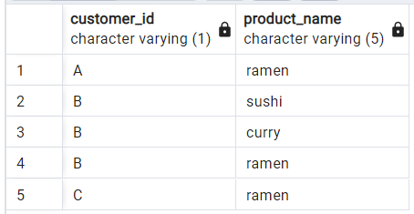 </kbd> <br>
</p>

- Ramen is a popular or favorite item on the menu for Customer A and C.
- Customer B has favorite all items on the menu.

<br>

---

### ***6. Which item was purchased first by the customer after they became a member?***

#### **Steps :**
- Create a **CTE** and use **windows function** with **DENSE_RANK** to create a new column rank based on `order_date` with filter **WHERE** `order_date` to be on or after `join_date`
- Filter results with **WHERE** product **rank = 1**


#### **Query :**

```sql
WITH item_after_member AS
(
	SELECT
		s.customer_id,
		order_date,
		join_date,
		product_id,
		DENSE_RANK() OVER(PARTITION BY s.customer_id ORDER BY s.order_date) AS rank
	FROM sales AS s
	JOIN members AS b
		ON s.customer_id = b.customer_id
	WHERE order_date > join_date
	)
SELECT 
	customer_id,
	order_date,
	join_date,
	product_name
FROM item_after_member AS i
JOIN menu as m
	ON i.product_id = m.product_id
WHERE rank = 1
ORDER BY 1
```

#### **Answer :**

<p align="left">
  <kbd>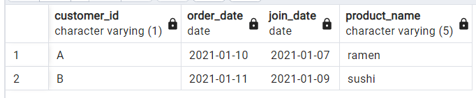 </kbd> <br>
</p>

- Customer A's first order as member is curry.
- Customer B's first order as member is sushi.
- Customer C is not member.

<br>

---

### ***7. Which item was purchased just before the customer became a member?***

#### **Steps :**
- Create a **CTE** and use **windows function** with **DENSE_RANK** to create a new column rank based on `order_date` with filter **WHERE** `order_date` to before `join_date`
- Filter results with **WHERE** product **rank = 1**

#### **Query :**

```sql
WITH item_before_member AS
(
	SELECT
		s.customer_id,
		order_date,
		join_date,
		product_id,
		DENSE_RANK() OVER(PARTITION BY s.customer_id ORDER BY s.order_date DESC) AS rank
	FROM sales AS s
	JOIN members AS b
		ON s.customer_id = b.customer_id
	WHERE order_date < join_date
	)
SELECT 
	customer_id,
	order_date,
	join_date,
	product_name
FROM item_before_member AS i
JOIN menu as m
	ON i.product_id = m.product_id
WHERE rank = 1
ORDER BY 1
```

#### **Answer :**

<p align="left">
  <kbd>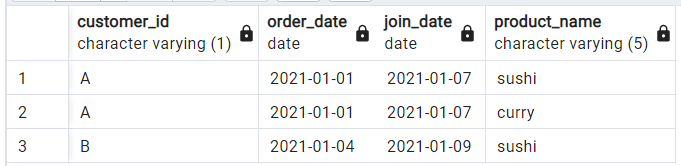 </kbd> <br>
</p>

- Customer A's last order before becoming member are sushi and curry.
- Customer B's last order before becoming member is sushi.
- Customer C is not member.
<br>

---

### ***8. What is the total items and amount spent for each member before they became a member?***

#### **Steps :**
- Use **COUNT DISTINCT** on `product_id` and **SUM** `price` before customer became member by filter `order_date` before `join_date`
- Use **GROUP BY** on `customer_id`

#### **Query :**

```sql
SELECT
	s.customer_id,
	COUNT(DISTINCT (s.product_id)) AS total_item,
	SUM(price) AS total_amount
FROM sales AS s
JOIN menu AS m
	ON s.product_id = m.product_id
JOIN members AS b
	ON s.customer_id = b.customer_id
WHERE order_date < join_date
GROUP BY 1 
```

#### **Answer :**

<p align="left">
  <kbd>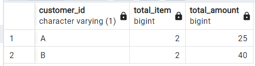 </kbd> <br>
</p>

- Customer A spent 25 dollars on 2 items before become member.
- Customer B spent 40 dollars on 2 items before become member.

<br>

---

### ***9. If each $1 spent equates to 10 points and sushi has a 2x points multiplier - how many points would each customer have?***

#### **Steps :**
- Condition :
    - All products except sushi = each 1 x 10 points
    - Sushi (product_id 1) = each 1 x (2 x 10) points
- Create cte and use **CASE WHEN** to create conditional statements to calculate `points`
- Use **SUM** and **GROUP BY** `customer_id` to get the total points for each customer


#### **Query :**

```sql
WITH menu_point AS 
(
	SELECT *,
		CASE 
			WHEN product_id = 1 THEN price * 20
			ELSE price * 10
		END AS points
	FROM menu
	)
SELECT 
	customer_id,
	SUM(points) AS total_point
FROM sales AS s
JOIN menu_point AS mp
	ON s.product_id = mp.product_id
GROUP BY 1
ORDER BY 1 
```

#### **Answer :**

<p align="left">
  <kbd>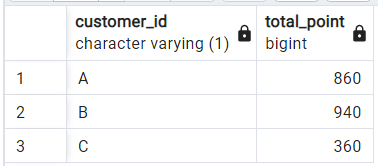 </kbd> <br>
</p>

- Total points for Customer A is 860.
- Total points for Customer B is 940.
- Total points for Customer C is 360.

<br>

---

### ***10. In the first week after a customer joins the program (including their join date) they earn 2x points on all items, not just sushi - how many points do customer A and B have at the end of January?***

#### **Steps :**
- Condition :
    - day X - `join_date`, 
        - points except sushi = each 1 * 10
        - points sushi = each 1 * 20 <br>
          <br>

    -  `join_date` - day 7 join date
        - points all item = each 1 * 20 <br>
        <br>

    - day 8 - last day of Jan 2021
        - Requirement for points same as before member

- Use **CASE WHEN** to create conditional statements and **GROUP BY** to calculate points each customer A and B.

#### **Query :**

```sql
SELECT 
	s.customer_id,
	SUM(
		CASE
			WHEN (order_date < join_date) OR (order_date > (join_date + 6)) THEN
				CASE 
					WHEN s.product_id = 1 THEN price * 20
					ELSE price * 10
				END
			ELSE price * 20
		END
	) AS member_points
FROM sales AS s
JOIN members AS b
	ON s.customer_id = b.customer_id
JOIN menu AS m
	ON s.product_id = m.product_id
WHERE s.order_date <= '2021-01-31'
GROUP BY 1

```

#### **Answer :**

<p align="left">
  <kbd>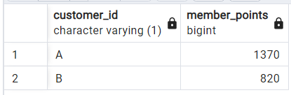 </kbd> <br>
</p>

- Total points at the end of January for Customer A is 1370.
- Total points at the end of January for Customer B is 820.

<br>

---

### ***Bonus Question: Join All The Things***
The following questions are related creating basic data tables that Danny and his team can use to quickly derive insights without needing to join the underlying tables using SQL

#### **Steps :**
- Use **CASE WHEN** to create conditional statements for column `member`
- Use **LEFT JOIN** `menu` and `member` on `sales`

#### **Query :**

```sql
SELECT 
	s.customer_id, 
	s.order_date, 
	m.product_name, 
	m.price,
	CASE
		WHEN mb.join_date > s.order_date THEN 'N'
		WHEN mb.join_date <= s.order_date THEN 'Y'
		ELSE 'N'
	END AS member
FROM sales AS s
LEFT JOIN menu AS m
	ON s.product_id = m.product_id
LEFT JOIN members AS mb
	ON s.customer_id = mb.customer_id
```

#### **Answer :**

<p align="left">
  <kbd>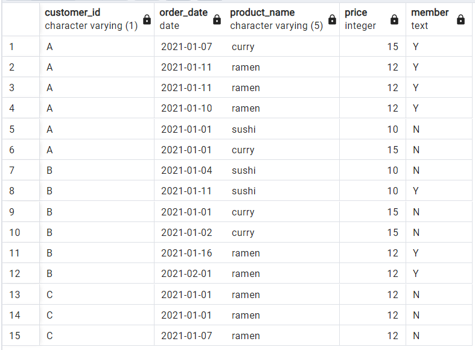 </kbd> <br>
</p>


<br>

---

### ***Bonus Question: Rank All The Things***
Danny also requires further information about the ranking of customer products, but he purposely does not need the ranking for non-member purchases so he expects null ranking values for the records when customers are not yet part of the loyalty program.

#### **Steps :**
- Create `summary` cte, use **CASE WHEN** to create conditional statements for column `member` and **LEFT JOIN** `menu` and `member` on `sales`
- Use **CASE WHEN** and **RANK** to create conditional statements for column `ranking`

#### **Query :**

```sql
WITH summary AS
(
	SELECT 
		s.customer_id, 
		s.order_date, 
		m.product_name, 
		m.price,
		CASE
			WHEN mb.join_date > s.order_date THEN 'N'
			WHEN mb.join_date <= s.order_date THEN 'Y'
			ELSE 'N'
		END AS member
	FROM sales AS s
	LEFT JOIN menu AS m
		ON s.product_id = m.product_id
	LEFT JOIN members AS mb
		ON s.customer_id = mb.customer_id
	)
SELECT *,
	CASE
		WHEN member = 'Y' THEN
			RANK () OVER(PARTITION BY customer_id, member ORDER BY order_date) 
		ELSE NULL
	END AS ranking
FROM summary
```

#### **Answer :**

<p align="left">
  <kbd>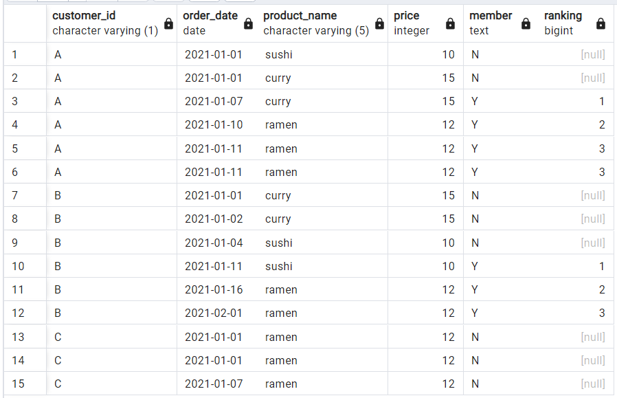 </kbd> <br>
</p>


<br>

---
## 🎉 **Mission Completed** 🎉
